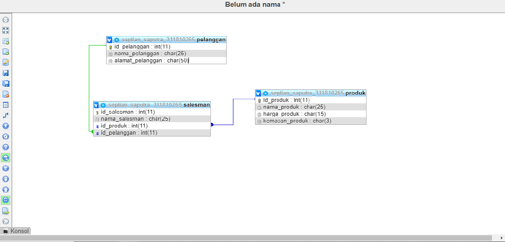
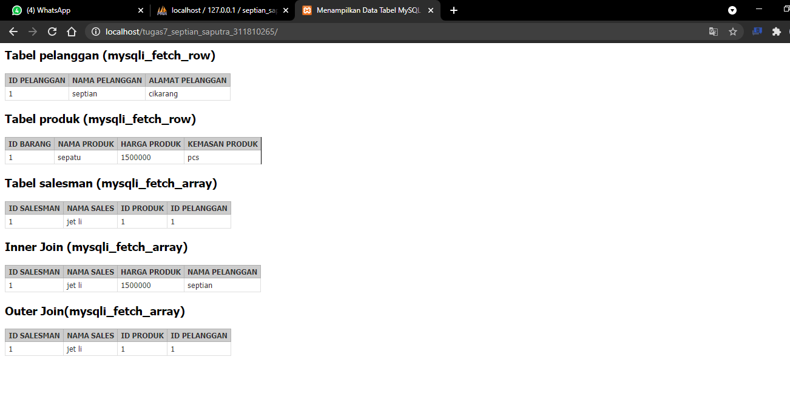

# Menampilkn-join-tabel
Langkah2  

1. buat tabel barang
2. buat tabel pelanggan
3. buat koneksi  di konkesi.php
4. buat halaman index di index.php

# Tampilan desain database (CDM / PDM / ERD)

# tampilan index

